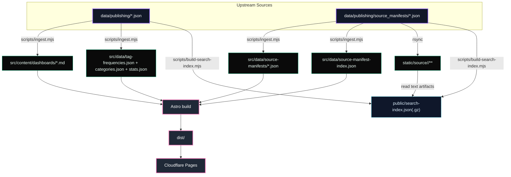

# NeuroHelix Site

Dual-layer Astro 5 + Tailwind 4 frontend for NeuroHelix. The site ships a polished, GitHub-quality dashboard experience *and* an IDE-inspired raw source explorer, all generated from the daily AI research pipeline.

## 🚀 Project Structure

```
site/
├── public/                      # Static assets (Hero.png, icons, search-index.json[.gz])
├── scripts/                     # Prebuild automation (ingest & MiniSearch index)
├── src/
│   ├── components/
│   │   ├── *.astro              # Hero, cards, filters, footer, KPI row
│   │   └── source/              # FileTree, ArtifactHeader, RawViewer, supporting UI
│   ├── content/dashboards       # Generated MD files (Astro content collection)
│   ├── data/                    # Derived data (tag-frequencies, categories, stats, source-manifest-index)
│   ├── layouts/                 # Base layout with analytics + SEO
│   ├── pages/
│   │   ├── index.astro          # Discovery hub with search + filters
│   │   ├── dashboards/[date].astro   # Processed view
│   │   ├── daily/[date]/source/**    # Source explorer routes
│   │   └── source/index.astro        # Meta index of all source archives
│   ├── scripts/                 # Client-side filter + search managers
│   └── styles/                  # Tokens, global styles, GitHub markdown theme
├── static/source/               # Raw artifact copies, mirrored per day
├── dist/                        # Build output (after `pnpm build`)
└── package.json
```

## ✨ Key Functionality

### Daily Dashboard Experience
- **Hero & CTA instrumentation** (`HeroSection.astro`): displays latest-run stats (days published, total reports, total insights) with Cloudflare analytics events on CTA clicks.
- **Filterable discovery grid** (`index.astro`, `DashboardCard.astro`): tag-weighted cloud, emoji category pills, sort controls, and an active filter bar that reflect the state managed by `FilterStateManager`.
- **MiniSearch-backed search bar**: `/` keyboard shortcut focuses search, queries are debounced (200 ms), and filters automatically synchronize with fuzzy ranked results or a string-match fallback if the index is unavailable.
- **GitHub-grade markdown rendering**: `src/styles/markdown.css` + Shiki highlight every heading, code block, and table; `dashboards/[date].astro` wraps sections in callout boxes and surfaces KPIs, tags, and categories.
- **Accessibility first**: skip link, focus-visible styles, custom events for keyboard users in TagCloud/CategoryFilters, aria-live copy for result counts, and cards that animate but remain in DOM for screen readers.

### Source Archive & Raw Explorer
- **Repo-style file tree** (`FileTree.astro`): mirrors `data/outputs/daily/YYYY-MM-DD` hierarchy exactly, with per-type filter chips, inline search, collapsible folders, and selected-path highlighting.
- **Source detail routes** (`/daily/:date/source/:path`): each artifact shows breadcrumbs, artifact type, display group, byte size, checksum short hash, timestamps, download + share actions, and a RawViewer tailored to its MIME.
- **RawViewer intelligence**: Markdown, JSON (with “Format” button), YAML, CSV, and generic text render with syntax highlighting; >2 MB files or binaries show guarded messaging and fall back to downloads.
- **Meta index** (`/source`): lists every published day with artifact counts, byte-size aggregates, type chips, and quick links back to processed dashboards.

### Search & Discovery Layer
- **Combined MiniSearch index** (`scripts/build-search-index.mjs`): indexes processed reports and every text-friendly source artifact (≤200 KB) with scope, artifactType, relative path, snippet, and tags.
- **Size-aware pipeline**: source content is truncated to 10 KB per file to keep payloads manageable; the builder auto-compresses `public/search-index.json` when it exceeds 2 MB.
- **Client runtime** (`src/scripts/searchManager.ts`): lazily loads the JSON index, enables fuzzy/prefix search, and returns ranked IDs consumed by the FilterStateManager so the UI stays reactive.

### Data Ingestion & Derived Artifacts
- **`scripts/ingest.mjs`**:
  - Converts every `../data/publishing/YYYY-MM-DD.json` into markdown content for Astro and removes stale Markdown files automatically.
  - Derives category assignments from tags, writes tag frequency data, and calculates global stats (total dashboards, insights, days published).
  - Copies `data/publishing/source_manifests/*.json` into `src/data/source-manifests`, builds a `source-manifest-index.json`, and logs aggregate artifact counts.
- **Static raw assets**: pipeline copies raw files into `static/source/<date>/…`, enabling deterministic download URLs and powering the RawViewer.
- **Search-friendly metadata**: manifests capture per-file checksums, prompt IDs, MIME, pre-computed TOCs, previews, and type counts for both UI rendering and future vector exports.

### Design System, Accessibility & Analytics
- **Tokenized theme** (`src/styles/tokens.css`): shared palette, typography, spacing, IDE-inspired accents, and GitHub-style markdown defaults.
- **Global styling**: Tailwind 4 via Vite plugin, global focus states, skip link, and mark highlighting for search.
- **Cloudflare Web Analytics**: Base layout automatically injects the beacon when `PUBLIC_CLOUDFLARE_ANALYTICS_TOKEN` is set; CTA buttons emit `data-cf-event` attributes for click tracking.

## 🧭 Route Overview

| Route | Purpose |
| --- | --- |
| `/` | Discovery hub with hero, search, tag cloud, category filters, dashboard grid. |
| `/dashboards/:date` | Processed markdown report + KPI row, tags, metadata, link to sources. |
| `/daily/:date/source/` | IDE-style explorer for that day’s manifest with tree + stats. |
| `/daily/:date/source/:path` | Raw artifact detail view with metadata header and RawViewer. |
| `/source` | Meta index listing every published day with artifact counts/type chips. |

## 🧞 Commands

Run everything from `site/`:

| Command | Action |
| :------ | :----- |
| `pnpm install` | Install dependencies. |
| `pnpm prebuild` | Run ingestion + search indexing manually (auto-runs before `build`). |
| `pnpm dev` | Start Astro dev server on `http://localhost:4321` (requires prebuild data). |
| `pnpm build` | Runs prebuild → `astro build`, outputs to `dist/`. |
| `pnpm preview` | Preview the production build locally. |
| `pnpm astro check` | Type-check + validate Astro content collections. |
| `node scripts/ingest.mjs` | Regenerate Markdown + data files only. |
| `node scripts/build-search-index.mjs` | Rebuild MiniSearch index only. |

> **Tip:** Because `pnpm build` automatically runs the `prebuild` script, local dev usually needs `pnpm prebuild && pnpm dev` when upstream `data/publishing` files change.

## 🔄 Data Flow



## ☁️ Cloudflare Analytics & Env Vars

The site is analytics-ready but privacy minded:

1. Create `site/.env` (or set environment variables in Cloudflare Pages):
   ```env
   PUBLIC_CLOUDFLARE_ANALYTICS_TOKEN=your_web_analytics_token
   ```
2. BaseLayout injects the beacon at runtime; no other configuration is required.

## 📚 Additional Docs

- `site/WARP.md` – project context for AI assistants.
- [Astro Docs](https://docs.astro.build) & [Tailwind 4 Docs](https://tailwindcss.com).

## 🚀 Deployment

- Target platform: **Cloudflare Pages**
  - Build command: `pnpm build`
  - Output directory: `dist`
- Recommended Node version: **18+**
- Upload the raw `data/publishing` artifacts (and `static/source/**`) before triggering the build so ingestion succeeds.
